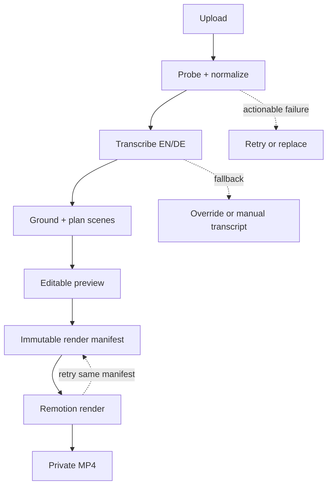

# MOTN Studio — Product Requirements Document

**Document status:** Local production handoff baseline  
**Version:** 1.0  
**Date:** 2026-07-21  
**Audience:** Product, design, frontend, media-processing, ML/AI, infrastructure, and QA engineering  
**Product stage:** Validated interactive prototype → production implementation

---

## 1. Executive summary

MOTN Studio turns a raw talking-head video into a premium, fast-paced, vertical explainer video. A creator uploads a source video, the system normalizes it, detects English or German speech, transcribes it with word-level timing, understands the meaning of each section, and creates a 9:16 Remotion composition. The output places a reframed talking head in the lower region, high-impact captions in the middle, and contextually accurate animated visualizations in the upper region. A creator can review and adjust the result before exporting a production-quality MP4.

The current prototype establishes the visual direction and several important editor interactions. It is not yet a production media pipeline. The production implementation must preserve the successful interaction and motion concepts while moving ingestion, normalization, transcription, durable storage, job orchestration, and final rendering to reliable backend services.

### Product promise

> Upload one talking-head video. Receive an accurate, premium, scroll-stopping vertical explainer that is ready to publish.

### Primary outcome

A first-time creator should be able to produce a publishable 1080 × 1920 MP4 without understanding editing, caption timing, animation, codecs, or Remotion.

---

## 2. Product vision and principles

### Vision

Make high-end motion design accessible as an automatic editing workflow, while preserving enough editorial control that a professional creator can trust and refine the result.

### Product principles

1. **Meaning before decoration.** Visuals must reinforce the speaker's actual claim, not add unrelated motion.
2. **Grounded, never fabricated.** The system must not invent companies, statistics, locations, products, quotes, or calls to action.
3. **Fast first draft.** The user should reach a watchable first cut with minimal decisions.
4. **Editable automation.** Transcript, scenes, visual direction, captions, pacing, crop, and branding remain user-adjustable.
5. **Preview and export must agree.** The Remotion Player and final renderer use the same composition package and scene specification.
6. **Honest system state.** Uploading, analyzing, rendering, failures, fallbacks, and stale edits are clearly represented.
7. **Privacy by default.** Source media is private, access-controlled, encrypted, and covered by explicit retention controls.
8. **Premium restraint.** Fast-paced does not mean noisy: motion, colors, sound, and density are governed by a coherent design system.

---

## 3. Problem statement

Talking-head creators need frequent short-form videos, but the labor-intensive steps are repetitive:

- converting arbitrary source media into an editable format;
- transcribing and timing speech accurately;
- finding the important claims and structuring a fast edit;
- adding captions with readable emphasis;
- researching and animating relevant brands, metrics, diagrams, and thematic visuals;
- reframing for vertical delivery;
- rendering a reliable MP4.

Existing caption-only tools accelerate transcription but do not consistently produce message-aware, premium motion graphics. Traditional editors offer control but require editing and motion-design expertise. MOTN Studio closes this gap with a grounded semantic storyboard and a reusable Remotion motion system.

---

## 4. Target users and jobs to be done

### 4.1 Primary users

| Persona | Context | Core need |
|---|---|---|
| Solo creator | Publishes educational, technology, business, or gaming videos several times per week | Turn raw speech into a polished short quickly |
| Social media editor | Produces many clips for clients or an internal brand | Generate a strong first cut and refine it predictably |
| Founder or marketer | Records product explanations without an editing team | Create credible branded content with minimal setup |
| Agency producer | Manages multiple brands and approvals | Repeat quality across projects, brand kits, and reviewers |

### 4.2 Jobs to be done

- **When** I record a useful explanation, **I want** the system to understand and visualize its core points, **so that** I can publish a compelling vertical video without manually animating it.
- **When** a transcript or visual is wrong, **I want** to correct it and regenerate only the affected sections, **so that** I do not lose the rest of my edit.
- **When** I mention a real company, metric, platform, or route, **I want** the visual to accurately represent it, **so that** the result feels intentional and trustworthy.
- **When** I approve a preview, **I want** the exported MP4 to match it, **so that** I can publish without another editing pass.
- **When** I work with private footage, **I want** clear access and retention controls, **so that** I can safely use the service for client or unreleased material.

### 4.3 Non-primary users for initial release

- Long-form documentary editors
- Teams needing frame-accurate multi-track nonlinear editing
- Users creating avatar-only or text-to-video content with no source video
- Users requiring broadcast mastering formats

---

## 5. Goals and success measures

### 5.1 Product goals

1. Produce an accurate first cut from a valid upload with no timeline-editing expertise required.
2. Support English and German as first-class languages, including language-appropriate captions and calls to action.
3. Accept common consumer and professional source formats through server-side FFmpeg normalization.
4. Generate contextually grounded motion scenes with verifiable source-to-scene traceability.
5. Render a consistent 9:16 H.264/AAC MP4 through a durable, observable job pipeline.
6. Preserve the current prototype's premium visual direction and responsive editor experience.

### 5.2 Launch metrics

| Metric | Beta target | Measurement |
|---|---:|---|
| Valid uploads reaching a playable normalized preview | ≥ 98% | Ingest funnel |
| EN/DE jobs reaching an editable transcript | ≥ 97% | Analysis job completion |
| Median time to first playable draft for a 60-second input | ≤ 4 minutes | Upload accepted → preview ready |
| Render success for supported projects | ≥ 98% | Render jobs excluding user cancellation |
| Preview/export visual parity defects | < 1% of completed renders | QA sampling and support tags |
| Grounding defects involving invented entities or numbers | 0 critical; < 0.5% scenes | Automated checks and review reports |
| First-draft scene acceptance without replacement | ≥ 70% | Scene edit telemetry |
| Median creator time from upload to first export request | ≤ 8 minutes | Product analytics |

Metrics are directional beta targets and should be recalibrated after the first 100–500 real projects.

---

## 6. Current prototype baseline

The existing prototype should be imported as the visual and interaction baseline, not discarded. It currently demonstrates:

- a premium dark editor shell and 9:16 Remotion Player;
- lower talking-head, middle-caption, upper-visual composition;
- sample storyboard and multiple animated visual treatments;
- local upload inspection and preview for browser-decodable media;
- browser-local English/German Whisper transcription with word timestamps;
- deterministic scene planning for known brands, metrics, routes, social platforms, and localized calls to action;
- working player play/pause, seek, progress, time, playback speed, and scene selection;
- functional fit/fill reframing, caption timing, source-audio, pacing, and timeline zoom controls;
- caption styles and scene-level visual redirection;
- browser-side export attempt with cancellation and explicit codec errors;
- unit coverage for core storyboard grounding cases.

Important limitations are intentional targets for the production implementation: browser codec support, model download and device performance, lack of durable projects, lack of backend processing, and unreliable browser-only MP4 rendering.

### 6.1 Current-versus-target truth table

| Capability | Current prototype truth | Production target | Required change |
|---|---|---|---|
| Source formats | Only media the user's browser can inspect and decode reliably | Common video/audio containers and codecs supported by the pinned FFmpeg build; corrupt, encrypted, or unsupported inputs rejected clearly | Resumable object-storage upload plus server FFmpeg probe/transcode |
| Upload limit | UI and local validation use a 500 MB limit | 500 MB beta limit, configurable by plan without code changes | Enforce at upload authorization, multipart completion, and ingest worker |
| Analyzed duration | First 90 seconds | First 90 seconds for beta; configurable and visible before upload | Server-enforced analysis window and project trim metadata |
| Language | Lightweight/browser Whisper flow for English and German | Automatic EN/DE detection with confidence, user override, and explicit unsupported-language handling | Server transcription service and language policy |
| Transcription | Browser-local model; depends on device, remote model download, memory, and browser | Durable server job with segment and word timestamps, retry, provider fallback, and stored output | Worker pipeline plus transcript persistence |
| Semantic understanding | Deterministic planner handles selected entities and patterns | Schema-constrained semantic planner grounded only in transcript and approved asset catalog | LLM/heuristic planning service, validation, provenance |
| Company logos | Several built-in marks; coverage is limited | Licensed/approved asset registry, exact entity matching, generic fallback, never a fabricated logo | Curated asset service and entity resolver |
| Thematic graphics | Prototype scene templates for selected topics | Extensible template registry covering core themes such as AI, business, travel, gaming, metrics, code, comparisons, and social CTAs | Versioned template/composition package |
| Captions | Working preview styles and word timing where transcript timestamps exist | EN/DE-aware line breaking, safe areas, emphasis, profanity policy, accessibility, and export parity | Shared caption layout engine and regression tests |
| Talking-head reframe | User-controlled fit/fill | Automatic face-aware vertical crop with user override; no face required | Shot/face tracking metadata and crop editor |
| Player transport | Play, pause, seek, progress, time, and speed are connected | Same plus keyboard shortcuts, robust loading/error states, and frame-accurate scene navigation | Harden current implementation |
| Timeline/editor state | Mostly local React state | Durable autosaved project revisions with conflict protection and undoable edits | API persistence, revision model, client cache |
| Preview | Remotion Player in browser | Remotion Player using the exact versioned composition/storyboard used for rendering | Shared package and immutable render manifest |
| MP4 export | Browser/WebCodecs attempt; device-dependent | Server-rendered 1080 × 1920 H.264/AAC MP4, downloadable from signed URL | Remotion renderer workers and render queue |
| Job processing | No durable orchestration | Idempotent ingest, transcribe, plan, and render jobs with retry/cancel/progress | Queue, workers, state machine, dead-letter handling |
| Storage | Blob URLs and session-local state | Private object storage for originals, proxies, thumbnails, audio, renders, and versioned metadata | S3-compatible storage and lifecycle rules |
| Authentication | Prototype access only | Authenticated users with per-project authorization | Identity integration and authorization middleware |
| Privacy | Local analysis is private but model assets are downloaded; no durable policy | Encryption, least privilege, signed URLs, retention/deletion controls, vendor disclosure | Security and data lifecycle implementation |
| Recovery | Refresh or device change can lose work | Projects resume from the last committed revision; jobs survive restarts | Postgres persistence and idempotent workers |
| Monitoring | Developer console and basic errors | Central logs, traces, metrics, alerting, job replay, and user-visible incident states | Observability platform and runbooks |

---

## 7. Scope

### 7.1 Beta/MVP scope

#### Creation

- Authenticated project creation.
- Direct or multipart upload of one talking-head source per project.
- Maximum source size of 500 MB.
- Analysis of the first 90 seconds; limits shown before upload.
- Server-side media probing and FFmpeg normalization.
- English and German automatic language detection, with manual override.
- Transcript with segment and word timings; editable text.
- Semantic storyboard generated from transcript content.
- 9:16 Remotion composition with:
  - talking head in the lower region;
  - caption band near the split/middle region;
  - semantic motion graphic in the upper region;
  - optional approved company/product marks when explicitly grounded;
  - source audio retained by default.
- Scene visual types: semantic hook, keyword/title, approved brand, exact statistic, grounded comparison, code/technology, travel route, gaming/theme, and social CTA.
- Three or more caption style presets.
- Per-project brand theme: palette, fonts from an approved catalog, watermark/logo upload, and CTA style.
- Scene-by-scene preview, selection, replacement, and text direction.
- Fit/fill crop plus manual positioning; automatic face crop is desirable but not a beta blocker if manual override is excellent.
- Draft autosave and project reopening.
- Server-side MP4 render at 1080 × 1920, 30 fps, H.264 video and AAC audio.
- Render progress, cancellation, retry, signed download, and retention notice.

#### Operational

- Job retries and idempotency.
- Structured validation and grounded-output checks.
- Per-user project authorization.
- Audit events for asset access and deletion.
- Error reporting and basic product analytics.

### 7.2 Post-beta/V1 scope

- Longer inputs and selectable source ranges.
- Multiple source clips and B-roll.
- Automatic silence removal and jump cuts.
- More languages.
- Saved brand kits and reusable style templates.
- Team workspaces, comments, review links, and approval states.
- Licensed stock footage/image search and generation with provenance.
- Multiple aspect ratios and platform variants.
- 4K or higher-quality export tiers.
- Burned-in sound design and licensed music automation.
- Public API and batch creation.

### 7.3 Explicitly out of scope for beta

- General-purpose multi-track nonlinear editing.
- Live collaborative editing.
- Arbitrary third-party plugin execution.
- Unlicensed scraping or redistribution of logos and media.
- Claims that literally every possible or damaged media file can be ingested.
- Browser-only production rendering as the primary export path.
- Guaranteed perfect transcription or semantic planning without user review.
- Automated publishing to social accounts.

---

## 8. End-to-end user flow

### 8.1 First project

1. User signs in and chooses **New video**.
2. Product explains the 500 MB limit, first-90-seconds analysis window, supported languages, privacy, and expected processing time.
3. User selects or drops a source file.
4. Client requests a resumable upload session and uploads directly to private object storage.
5. UI shows byte progress and allows cancellation or recovery from a dropped connection.
6. Server validates object size/checksum, probes the media, and creates the normalized proxy, thumbnail, waveform/audio, and technical metadata.
7. If the file is corrupt, encrypted, has no usable video, or exceeds policy, the project enters an actionable failure state without pretending processing succeeded.
8. Transcription job analyzes the configured source range, auto-detects English or German, and stores timed words/segments and confidence.
9. A planning job extracts only transcript-grounded entities, claims, metrics, locations, comparisons, topics, and CTA intent; it creates a schema-valid storyboard.
10. The editor opens as soon as the normalized proxy and a first transcript/storyboard are ready. Stages can progressively populate.
11. User previews the automatically generated cut.
12. User can:
    - correct transcript text;
    - override language;
    - regenerate affected scenes;
    - select a different motion template;
    - modify scene direction;
    - change caption style and emphasis;
    - adjust crop, pacing, audio, palette, fonts, and brand mark;
    - seek and play through the entire sequence.
13. Transcript changes mark dependent scenes as stale. The UI identifies exactly which scenes require regeneration; unaffected edits remain intact.
14. User selects **Export MP4**, confirms the current revision, and starts a render job.
15. UI shows queued/rendering/uploading states, progress, estimated remaining time when reliable, and a cancel action.
16. On success, user watches a rendered preview and downloads from a time-limited signed URL.
17. User can return later, duplicate the project, revise it, or explicitly delete source and output assets.

### 8.2 Failure and recovery flow

- Upload interruptions resume from completed parts where supported.
- Worker operations are idempotent; re-delivery never creates duplicate project artifacts.
- Retryable failures retry automatically with bounded exponential backoff.
- Non-retryable failures show a plain-language reason and suggested next action.
- A failed transcript can be retried, language-overridden, or manually supplied.
- A failed scene plan can fall back to a generic but transcript-grounded visual.
- A failed render can be retried from the immutable render manifest without re-upload or re-transcription.
- Users can cancel active analysis/render jobs; cancellation is best-effort and terminal state is reflected accurately.

---

## 9. Functional requirements

Requirement IDs should be retained in issues and tests.

### 9.1 Accounts and projects

- **FR-001:** Users must authenticate before creating or accessing durable projects.
- **FR-002:** Each project must have an owner and all read/write endpoints must enforce project authorization server-side.
- **FR-003:** The dashboard must list project title, thumbnail, language, duration, last edited time, and processing/render state.
- **FR-004:** Project edits must autosave as revisions and survive refresh, sign-out, and device change.
- **FR-005:** The API must prevent accidental overwrites through revision numbers or equivalent optimistic concurrency.
- **FR-006:** A user must be able to duplicate and delete a project. Deletion must start an auditable asset-lifecycle workflow.

### 9.2 Upload and normalization

- **FR-100:** The beta must accept files up to 500 MB using resumable direct-to-object-storage upload.
- **FR-101:** Upload acceptance must be based on server probing, not filename extension or client-reported MIME type alone.
- **FR-102:** The ingest worker must use a pinned FFmpeg/FFprobe build and normalize supported media to a browser-preview proxy and renderer-safe mezzanine or proxy format.
- **FR-103:** Supported input policy must cover common FFmpeg-readable combinations including MP4, MOV, WebM, MKV, AVI, MPEG, and M4V, subject to actual stream decode.
- **FR-104:** The system must explicitly reject corrupt, encrypted/DRM-protected, zero-length, no-video, over-limit, or unsupported media with a stable error code.
- **FR-105:** Rotation, pixel aspect ratio, color metadata, sample rate, channel layout, and variable frame rate must be normalized or represented correctly.
- **FR-106:** Audio must be extracted to a transcription-safe mono stream while preserving the normalized source audio for final output.
- **FR-107:** Ingest must produce width, height, duration, frame rate, codecs, rotation, audio metadata, checksum, thumbnail, and a normalized proxy URI.
- **FR-108:** Originals and derived media must remain private and be accessed only through short-lived signed URLs or an authorized media proxy.

### 9.3 Transcription and language

- **FR-200:** The system must automatically classify English, German, or unsupported/uncertain, with confidence recorded.
- **FR-201:** Users must be able to override detected language and rerun transcription.
- **FR-202:** The transcript must contain ordered segments and words with start/end times relative to the analyzed range.
- **FR-203:** Word timings must be monotonic, nonnegative, within source duration, and validated before storyboard creation.
- **FR-204:** Transcript text must be editable. Edits preserve timing where safe or mark affected timing/scene ranges stale.
- **FR-205:** The UI must distinguish transcription progress, failure, partial output, edited output, and synchronized output.
- **FR-206:** The beta analyzes at most the first 90 seconds and must clearly represent any unprocessed duration.
- **FR-207:** Provider/model name, model version, language, confidence, and processing timestamps must be stored for reproducibility.
- **FR-208:** A user may supply a manual transcript if automatic transcription fails; missing word timings use segment interpolation and are labeled as approximate.

### 9.4 Semantic analysis and storyboard

- **FR-300:** Storyboard generation must use only transcript content, user-provided direction, project brand settings, and an approved asset/template catalog.
- **FR-301:** Planner output must be validated against a versioned JSON schema before being saved.
- **FR-302:** Every non-generic scene must include provenance: transcript span, word/time range, and extracted evidence.
- **FR-303:** Exact numbers, percentages, currencies, company names, products, locations, route endpoints, social networks, and CTA wording must not be introduced unless present in source/user input.
- **FR-304:** Entity matching must use stable asset catalog IDs. A missing or ambiguous asset must fall back to a generic semantic visual, not a guessed logo.
- **FR-305:** Storyboard scenes must be chronological, non-overlapping unless explicitly supported, cover the intended analyzed range, and respect minimum/maximum readable durations.
- **FR-306:** Pacing mode must influence scene density and animation intensity without changing factual content.
- **FR-307:** English and German must receive language-appropriate line breaking, semantic classification, and CTA treatment.
- **FR-308:** A transcript edit must invalidate only dependent scene ranges when possible.
- **FR-309:** Users must be able to regenerate all stale scenes or one selected scene without losing manual changes elsewhere.
- **FR-310:** Planner failures must produce a safe generic fallback scene anchored to transcript keywords.

### 9.5 Composition and visual system

- **FR-400:** The canonical beta composition must be 1080 × 1920 at 30 fps.
- **FR-401:** The lower portion must show the source talking head with fit/fill and positional controls; the safe layout must adapt to aspect ratio and crop.
- **FR-402:** Captions must occupy a stable, legible band around the middle/split area and remain inside configurable social safe areas.
- **FR-403:** The upper portion must render the active scene's semantic motion template.
- **FR-404:** Motion templates must be deterministic for a given render manifest and may not depend on runtime network requests.
- **FR-405:** The shared composition package must be used by both browser preview and server render.
- **FR-406:** The template registry must declare supported scene schema, asset dependencies, version, duration constraints, and preview component.
- **FR-407:** Brand/logo assets must be approved, versioned, stored with rights/provenance metadata, and resolved by catalog ID.
- **FR-408:** If no grounded specialist visual exists, the composition must use a premium generic keyword/diagram visual that does not imply unsupported facts.
- **FR-409:** Animation must respect readability: caption dwell time, maximum simultaneous elements, contrast, and safe-area checks.
- **FR-410:** A reduced-motion editor setting may reduce preview animation but must not silently alter the selected final render style.

### 9.6 Captions

- **FR-500:** Caption presets must define font, size, line height, case, color, background, emphasis, maximum words/characters per line, and transition behavior.
- **FR-501:** Word highlighting must be driven by validated word timestamps and behave correctly during pauses.
- **FR-502:** Users must be able to disable word-by-word timing and use phrase-level captions.
- **FR-503:** Caption layout must avoid clipping at German compound-word lengths through tested wrapping/hyphenation/fallback behavior.
- **FR-504:** User-edited transcript text must be reflected in preview and final render from the same revision.
- **FR-505:** Captions must meet the product's minimum contrast target and configured mobile safe areas.

### 9.7 Editor and playback

- **FR-600:** Play, pause, seek, current time, duration, progress, playback rate, and active scene must remain synchronized with Remotion Player events.
- **FR-601:** Timeline and scene cards must seek accurately to their scene starts and visibly identify the active scene.
- **FR-602:** Users must be able to zoom and horizontally scroll the timeline without losing the playhead.
- **FR-603:** Fit/fill, crop position, source audio, caption timing, and pacing controls must modify the actual composition.
- **FR-604:** Editor controls must expose keyboard and screen-reader semantics, including tabs, pressed state, switches, ranges, and statuses.
- **FR-605:** Upload, analysis, save, stale, render, cancellation, error, and success states must not be represented by cosmetic timers.
- **FR-606:** Unsupported actions must be disabled with a reason, not left visually interactive but inert.
- **FR-607:** The editor must warn before export when the transcript/storyboard is stale or unsaved.
- **FR-608:** The user must be able to compare the current scene with its transcript evidence and replace its visual template.

### 9.8 Rendering and delivery

- **FR-700:** Export must create an immutable render manifest referencing a specific project revision, composition version, asset versions, and output preset.
- **FR-701:** A render job must be queued and processed by a server-side Remotion renderer with a pinned Chromium, Node, Remotion, FFmpeg, font, and composition environment.
- **FR-702:** The beta output must be an MP4 with 1080 × 1920 video, H.264 codec, 30 fps, AAC audio, and streaming-friendly metadata placement.
- **FR-703:** Preview and export must consume the same storyboard and layout configuration; automated parity checks must cover representative frames.
- **FR-704:** Jobs must support queued, preparing, rendering, uploading, succeeded, failed, cancel-requested, and cancelled states.
- **FR-705:** Progress must originate from renderer/job events and be monotonic; indeterminate stages must be labeled as such.
- **FR-706:** Render requests must be idempotent by request key. Duplicate submissions must not create unintended duplicate charges or outputs.
- **FR-707:** Successful outputs must be stored privately and exposed through an expiring authorized download URL.
- **FR-708:** Failed renders must retain sufficient diagnostic metadata for support while excluding raw secrets or transcript/media contents from routine logs.
- **FR-709:** Users must be able to retry a failed render from the same manifest and create a new render after project edits.

### 9.9 Brand and assets

- **FR-800:** Users may configure palette, approved font, watermark/logo, and CTA styling per project.
- **FR-801:** Uploaded brand assets must be virus/malware scanned, type-validated, dimension-limited, and normalized.
- **FR-802:** Third-party logos must come from an approved catalog with source/license/provenance fields.
- **FR-803:** Generated or stock imagery, if introduced later, must include usage rights and provenance and must never be silently mixed into beta output.

---

## 10. UX and visual requirements

### 10.1 Editor information architecture

- **Header:** project title, save state, privacy state, undo/redo when available, settings, export.
- **Left panel:** upload/source, transcript, scene/storyboard, brand/style tabs.
- **Center:** 9:16 Remotion Player with transport directly below.
- **Right or contextual panel:** selected scene direction, template alternatives, evidence, crop and visual settings.
- **Bottom timeline:** scene spans, active playhead, stale/error indicators, zoom.

The exact responsive layout may differ from the prototype, but no essential control may disappear on smaller desktop widths. Mobile web may be view/review-only during beta if clearly documented.

### 10.2 Composition zones

The layout must be tokenized rather than hard-coded per scene. Initial design guidance:

- Upper semantic visual: approximately top 50–58%.
- Caption/split band: visually anchored around the middle, with safe-area-aware offset.
- Talking-head region: approximately lower 38–46%.
- All text and meaningful marks stay inside configurable platform-safe margins.

These are design constraints, not rigid percentages; templates must pass visual QA across representative faces, crops, and caption lengths.

### 10.3 Premium motion language

- Strong hierarchy, restrained palette, high contrast, precise easing, purposeful entry/exit motion.
- Fast pacing driven by semantic beats rather than random cuts.
- Motion intensity presets: calm, balanced, dopamine.
- No unlicensed copied brand animations.
- No gratuitous flashing; respect accessibility and photosensitivity guidance.
- Sound design is off or minimal in beta unless licensed assets and volume controls are implemented.

---

## 11. Recommended production architecture

### 11.1 Repository topology

Use a TypeScript monorepo and retain the existing frontend/components where practical:

```text
motn-studio/
├── apps/
│   ├── web/                 # React/Next.js editor, dashboard, Remotion Player
│   ├── api/                 # Authenticated HTTP API and webhook handlers
│   ├── media-worker/        # FFmpeg probe/normalization/audio extraction
│   ├── analysis-worker/     # Transcription, language detection, semantic planning
│   └── render-worker/       # Remotion server rendering and output packaging
├── packages/
│   ├── compositions/        # Canonical Remotion compositions/templates
│   ├── contracts/           # Zod/JSON schemas and API/event types
│   ├── storyboard/          # Grounding, timing, and deterministic planner helpers
│   ├── design-system/       # Editor UI, caption and motion tokens
│   ├── asset-catalog/       # Approved brand/theme asset metadata
│   ├── observability/       # Logs, tracing, metrics helpers
│   └── test-fixtures/       # Licensed/synthetic EN/DE media fixtures
├── infra/                   # IaC, containers, queues, storage, database
├── docs/                    # ADRs, runbooks, threat model, product docs
└── AGENTS.md                # Codex build, test, architecture, and safety conventions
```

Do not rewrite the prototype merely to conform to a fashionable framework. First extract reusable composition, planner, and UI code behind clean contracts; migrate incrementally.

### 11.2 Service responsibilities

| Component | Responsibilities |
|---|---|
| Web | Authentication UI, upload orchestration, editor state, Remotion Player, transcript/storyboard editing, render request/status |
| API | Authorization, upload sessions, project revisions, job creation, signed media access, render manifests, deletion |
| Media worker | FFprobe validation, FFmpeg normalization, thumbnails, proxy, audio extraction, metadata |
| Analysis worker | EN/DE detection, transcription, word alignment, entity/claim extraction, schema-constrained storyboard |
| Render worker | Resolve immutable manifest, validate assets, bundle/cache composition, render frames/audio, encode MP4, upload result |
| PostgreSQL | Users/workspaces, projects/revisions, asset metadata, transcripts, storyboards, jobs, render manifests, audits |
| Object storage | Originals, normalized proxies, waveforms/thumbnails, user assets, render intermediates, MP4 outputs |
| Queue | Durable stage execution, retries, scheduling, cancellation signaling, dead-letter routing |

### 11.3 Reference stack

The team may substitute equivalent managed services, but must preserve contracts and properties:

- **Frontend/API:** TypeScript, React, Remotion Player, a server framework compatible with the existing app.
- **Schemas:** Zod as the runtime source of truth, emitting JSON Schema where needed.
- **Database:** PostgreSQL with migrations and row-scoped authorization in the service layer.
- **Object storage:** S3-compatible private buckets, multipart upload, checksums, lifecycle rules.
- **Queue:** Redis/BullMQ for a small controlled deployment, or SQS/managed equivalent for stronger operational isolation.
- **Media:** pinned FFmpeg/FFprobe container image.
- **Transcription:** server Whisper implementation/provider that returns word timestamps; store model/provider version and build an adapter to avoid lock-in.
- **Semantic planner:** schema-constrained LLM plus deterministic grounding/validation. The model never directly selects arbitrary remote assets.
- **Rendering:** Remotion renderer in autoscaled containers or Remotion Lambda where appropriate; pinned Chromium and fonts.
- **Observability:** OpenTelemetry traces, structured logs, metrics backend, error reporting.
- **Deployment:** separate web/API and worker deployments; workers scale by queue depth and resource class.

### 11.4 Pipeline state machine



Each arrow is a durable transition backed by stored state and an idempotent job. The UI must not infer completion from elapsed time.

### 11.5 Key architecture decisions

1. **Server normalize all production uploads.** Browser playback support is not the definition of format support.
2. **Use one shared composition package.** Divergent preview/render code is not acceptable.
3. **Freeze every render.** A render manifest contains immutable inputs and versions.
4. **Store provenance.** Every semantic scene can be traced to transcript evidence and an asset/template version.
5. **Prefer adapters.** Transcription, semantic model, storage, and queue vendors sit behind tested interfaces.
6. **No runtime network dependencies in renders.** Fetch and pin all fonts/assets before rendering.
7. **Separate CPU, GPU, and rendering workloads.** Media/transcription/render workers scale independently.

---

## 12. Core data contracts

The following TypeScript shapes are illustrative requirements. Implement them in `packages/contracts` with Zod schemas, database mappings, API documentation, and backwards-compatible versioning.

```ts
type UUID = string;
type ISODateTime = string;
type Language = "en" | "de" | "unsupported" | "unknown";

interface Project {
  id: UUID;
  ownerId: UUID;
  title: string;
  status:
    | "draft"
    | "uploading"
    | "ingesting"
    | "analyzing"
    | "ready"
    | "failed"
    | "deleting";
  currentRevisionId: UUID | null;
  sourceAssetId: UUID | null;
  language: Language;
  languageOverride: "en" | "de" | null;
  analysisStartMs: number;
  analysisEndMs: number | null;
  createdAt: ISODateTime;
  updatedAt: ISODateTime;
}

interface MediaAsset {
  id: UUID;
  projectId: UUID;
  kind: "original" | "proxy" | "audio" | "thumbnail" | "brand" | "render";
  storageKey: string;          // never expose directly to an unauthorized client
  checksumSha256: string;
  byteSize: number;
  mimeType: string;
  width?: number;
  height?: number;
  durationMs?: number;
  videoCodec?: string;
  audioCodec?: string;
  frameRate?: number;
  rotation?: number;
  state: "pending" | "ready" | "quarantined" | "failed" | "deleted";
  createdAt: ISODateTime;
}

interface TranscriptWord {
  id: string;
  text: string;
  startMs: number;
  endMs: number;
  confidence?: number;
  timing: "model" | "aligned" | "approximate" | "edited";
}

interface TranscriptSegment {
  id: string;
  text: string;
  startMs: number;
  endMs: number;
  words: TranscriptWord[];
  speaker?: string;
}

interface TranscriptRevision {
  id: UUID;
  projectId: UUID;
  version: number;
  language: "en" | "de";
  languageConfidence?: number;
  provider: string;
  modelVersion: string;
  segments: TranscriptSegment[];
  editedByUser: boolean;
  createdAt: ISODateTime;
}
```

```ts
type SceneVisualKind =
  | "hook"
  | "keyword"
  | "brand"
  | "metric"
  | "comparison"
  | "code"
  | "route"
  | "gaming"
  | "social-cta";

interface EvidenceRef {
  transcriptRevisionId: UUID;
  segmentIds: string[];
  startMs: number;
  endMs: number;
  excerptHash: string;
}

interface GroundedEntityRef {
  catalogId: string;
  canonicalName: string;
  mention: string;
  evidence: EvidenceRef;
}

interface StoryboardScene {
  id: string;
  startMs: number;
  endMs: number;
  title?: string;
  visualKind: SceneVisualKind;
  templateId: string;
  templateVersion: string;
  direction: string;
  evidence: EvidenceRef;
  entities: GroundedEntityRef[];
  metric?: {
    raw: string;
    value?: number;
    unit?: string;
  };
  route?: { origin: string; destination: string };
  platforms?: string[];
  cta?: { text: string; locale: "en" | "de" };
  userLocked: boolean;
}

interface StoryboardRevision {
  id: UUID;
  projectId: UUID;
  transcriptRevisionId: UUID;
  schemaVersion: number;
  plannerVersion: string;
  pacing: "calm" | "balanced" | "dopamine";
  scenes: StoryboardScene[];
  createdAt: ISODateTime;
}
```

```ts
interface CompositionSettings {
  width: 1080;
  height: 1920;
  fps: 30;
  sourceFit: "cover" | "contain";
  sourcePosition: { x: number; y: number; scale: number };
  sourceAudioEnabled: boolean;
  sourceAudioGain: number;
  captionPresetId: string;
  wordTimingEnabled: boolean;
  pacing: "calm" | "balanced" | "dopamine";
  theme: {
    background: string;
    foreground: string;
    accent: string;
    fontId: string;
    brandAssetId?: UUID;
  };
}

interface ProjectRevision {
  id: UUID;
  projectId: UUID;
  version: number;
  transcriptRevisionId: UUID;
  storyboardRevisionId: UUID;
  compositionSettings: CompositionSettings;
  createdBy: UUID;
  createdAt: ISODateTime;
}

interface RenderManifest {
  id: UUID;
  projectId: UUID;
  projectRevisionId: UUID;
  compositionId: string;
  compositionVersion: string;
  assetChecksums: Record<UUID, string>;
  output: {
    container: "mp4";
    videoCodec: "h264";
    audioCodec: "aac";
    width: 1080;
    height: 1920;
    fps: 30;
    qualityPreset: "social-hq";
  };
  createdAt: ISODateTime;
}

interface Job {
  id: UUID;
  projectId: UUID;
  kind: "ingest" | "transcribe" | "plan" | "render" | "delete";
  state:
    | "queued"
    | "running"
    | "cancel_requested"
    | "cancelled"
    | "succeeded"
    | "failed";
  stage?: string;
  progress?: number; // 0..1 only when measurable
  attempt: number;
  idempotencyKey: string;
  errorCode?: string;
  createdAt: ISODateTime;
  updatedAt: ISODateTime;
}
```

### 12.1 API surface

Minimum authenticated endpoints:

| Method | Path | Purpose |
|---|---|---|
| `POST` | `/v1/projects` | Create project |
| `GET` | `/v1/projects` | List authorized projects |
| `GET` | `/v1/projects/:id` | Load project/editor bootstrap state |
| `POST` | `/v1/projects/:id/uploads` | Start multipart/resumable upload |
| `POST` | `/v1/uploads/:id/complete` | Verify parts/checksum and queue ingest |
| `GET` | `/v1/projects/:id/jobs` | Read current job states or obtain event channel |
| `PATCH` | `/v1/projects/:id/transcript` | Save transcript revision with expected version |
| `POST` | `/v1/projects/:id/transcript/retry` | Retry transcription/override language |
| `PATCH` | `/v1/projects/:id/storyboard` | Save scene edits with expected version |
| `POST` | `/v1/projects/:id/storyboard/regenerate` | Regenerate stale/all/specific scene ranges |
| `PATCH` | `/v1/projects/:id/composition` | Save crop, captions, theme, pacing, and audio settings |
| `POST` | `/v1/projects/:id/renders` | Freeze revision and queue render; requires idempotency key |
| `GET` | `/v1/renders/:id` | Render state, progress, error, and authorized result |
| `POST` | `/v1/renders/:id/cancel` | Request cancellation |
| `DELETE` | `/v1/projects/:id` | Begin project and asset deletion workflow |

Use server-sent events or a similarly simple authorized channel for live job progress. Polling remains a supported fallback. All state-changing endpoints require authenticated authorization, validation, request IDs, rate limits, and idempotency where applicable.

### 12.2 Stable ingest error codes

At minimum:

- `FILE_TOO_LARGE`
- `EMPTY_FILE`
- `CHECKSUM_MISMATCH`
- `MEDIA_PROBE_FAILED`
- `NO_VIDEO_STREAM`
- `UNSUPPORTED_CODEC`
- `ENCRYPTED_OR_DRM_MEDIA`
- `DURATION_INVALID`
- `NORMALIZATION_FAILED`
- `AUDIO_EXTRACTION_FAILED`
- `LANGUAGE_UNSUPPORTED`
- `TRANSCRIPTION_FAILED`
- `STORYBOARD_VALIDATION_FAILED`
- `RENDER_FAILED`
- `RENDER_CANCELLED`

User copy must be mapped separately from diagnostic detail.

---

## 13. Nonfunctional requirements

### 13.1 Reliability and correctness

- **NFR-001:** Jobs are at-least-once deliverable and idempotent at every side-effect boundary.
- **NFR-002:** No project may reach `ready` without a playable normalized proxy and schema-valid persisted metadata.
- **NFR-003:** No render may start without a valid immutable manifest and accessible checksummed assets.
- **NFR-004:** Preview/render composition version mismatch must fail closed.
- **NFR-005:** User-facing status must be derived from persisted server state.
- **NFR-006:** A worker restart must not lose an accepted upload or completed stage.

### 13.2 Performance objectives

- Upload endpoint authorization response p95 ≤ 500 ms, excluding identity-provider latency.
- Editor bootstrap API p95 ≤ 1.5 seconds for a 90-second project, excluding media download.
- Normalized proxy should become playable before full semantic planning when pipeline ordering permits.
- Median first draft ≤ 4 minutes for a 60-second 1080p input under normal beta load.
- Player interactions target 60 fps on a supported modern desktop, with graceful degradation.
- Standard 60-second render target: median ≤ 5 minutes and p95 ≤ 12 minutes under declared supported load.
- Job progress/status freshness ≤ 5 seconds.

### 13.3 Availability and disaster recovery

- Beta availability target: 99.5% monthly for authenticated API/editor, excluding scheduled maintenance.
- Database automated backups with tested point-in-time recovery.
- Object storage versioning or equivalent protection where retention policy permits.
- Queue dead-letter handling and documented replay procedure.
- Recovery point and time objectives must be defined before external beta; recommended starting targets are RPO ≤ 15 minutes and RTO ≤ 4 hours for metadata.

### 13.4 Compatibility

- Current and previous major versions of Chrome, Edge, Firefox, and Safari on desktop, with codec/proxy choices tested explicitly.
- Editor minimum viewport documented; view-only mobile fallback allowed for beta.
- Render output validated on iOS/Android native players and major social-platform upload validators.

### 13.5 Accessibility

- Editor targets WCAG 2.2 AA for navigation, labels, contrast, focus order, error association, and keyboard interaction.
- Captions target configured contrast and safe-area rules.
- Animated editor UI respects `prefers-reduced-motion`; exported motion style is an explicit project choice.

### 13.6 Cost controls

- Record cost per minute by ingest, transcription, planning, and rendering stage.
- Apply per-user concurrency and monthly usage limits.
- Cache deterministic composition bundles and approved assets.
- Abort cancelled renders quickly and delete unneeded intermediates by lifecycle policy.
- Alert on anomalous retry loops, render durations, egress, and model spend.

---

## 14. Security and privacy

### 14.1 Security requirements

- TLS for all network traffic and provider-managed encryption at rest.
- Private object buckets; no predictable or permanent public media URLs.
- Short-lived, audience-scoped signed URLs with content-disposition and content-type controls.
- Server-side project authorization on every metadata and asset operation.
- Separate worker identities with least-privilege access to required prefixes and queues.
- Secrets stored in a managed secret store, never in source, client bundles, render manifests, or logs.
- Uploads validated by content, scanned where applicable, and processed inside isolated resource-limited workers.
- FFmpeg and Chromium containers patched and rebuilt regularly; dependency and image scanning in CI.
- Rate limits, file limits, job concurrency limits, and render timeouts defend against abuse.
- User-supplied filenames, transcript text, URLs, SVGs, fonts, and planner output treated as untrusted input.
- SVG/HTML assets sanitized or rasterized before rendering; no arbitrary script execution.
- Audit events for authentication changes, project access, export, and deletion.

### 14.2 Privacy requirements

- Clearly disclose which subprocessors receive audio, transcript, or prompts.
- Do not use customer media or transcripts for model training unless the user separately and explicitly opts in.
- Minimize semantic-planner payloads to transcript segments and required metadata; do not send raw video when unnecessary.
- Provide a project deletion action and documented completion window.
- Define configurable retention for originals, derived media, failed intermediates, and completed renders.
- User-facing privacy copy must distinguish browser-local preview behavior from server processing.
- Support data export and deletion obligations applicable to launch markets; complete legal review before public release.
- Avoid transcript/media contents in routine telemetry. Use IDs, bounded metadata, and scrubbed errors.

### 14.3 Threat-model focus areas

- Cross-project object access and signed-URL leakage.
- Malicious media exploiting codecs or exhausting CPU/memory/disk.
- Prompt injection within transcripts causing planner or asset-selection abuse.
- Stored XSS through transcript, scene direction, filenames, or SVG assets.
- SSRF through user-supplied asset URLs.
- Render sandbox escape or arbitrary code/template injection.
- Queue replay, duplicate billing, and unauthorized cancellation.
- Accidental retention after user deletion.

---

## 15. Observability and operations

### 15.1 Structured events

Every request and job includes `requestId`, `projectId`, `jobId`, `user/workspaceId` where permitted, stage, attempt, worker version, and duration. Do not log raw transcript/media by default.

Key events:

- `upload.started`, `upload.part_completed`, `upload.completed`, `upload.failed`
- `ingest.probed`, `ingest.normalized`, `ingest.failed`
- `transcription.started`, `transcription.completed`, `transcription.failed`
- `storyboard.generated`, `storyboard.validation_failed`, `storyboard.scene_regenerated`
- `revision.saved`, `revision.conflict`
- `render.queued`, `render.started`, `render.progress`, `render.succeeded`, `render.failed`, `render.cancelled`
- `asset.download_authorized`, `project.deletion_started`, `project.deletion_completed`

### 15.2 Metrics and dashboards

- Upload completion and failure rate by size/container/codec.
- Stage latency histograms and queue wait times.
- Worker saturation, CPU/GPU/memory/disk, timeouts, retries, dead letters.
- Transcription failure and language-uncertain rate.
- Storyboard schema/grounding failure and generic-fallback rate.
- Preview player errors and client performance.
- Render success, duration per output minute, cancellation, retry, and codec validation.
- Storage growth, asset lifecycle lag, egress, and cost per successful export.
- Funnel from project creation → upload → first draft → render → download.

### 15.3 Alerts

- Render or ingest success below SLO over a meaningful rolling window.
- Queue age exceeds the user-facing target.
- Dead-letter count is nonzero or increasing.
- Signed URL/authorization errors spike.
- Database/storage capacity threshold.
- Asset deletion jobs exceed retention SLA.
- Model/provider latency or error budget exceeded.
- Grounding validator allows any invented entity/metric in automated canary fixtures.

### 15.4 Runbooks

Before external beta, document: stuck upload, ingest failure by codec, transcription outage, provider fallback, queue backlog, render failure, corrupted output, unauthorized access incident, object-storage outage, deletion backlog, and rollback of a composition/template release.

---

## 16. Test and quality plan

### 16.1 Unit tests

- Transcript timing validation and edit invalidation.
- English/German language and line-breaking utilities.
- Entity, metric, route, comparison, platform, CTA extraction.
- Grounding validator: explicitly test that unsupported brands/numbers never appear.
- Scene timing/coverage and pacing rules.
- Render-manifest hashing and idempotency.
- Job state transitions and retry classification.
- Authorization policies and signed asset scopes.
- Caption chunking and pause behavior.

### 16.2 Contract and integration tests

- API schemas generated from shared contracts.
- Multipart upload completion, checksum, retry, and cancellation.
- Queue redelivery and worker idempotency.
- FFprobe/FFmpeg outputs across the media fixture matrix.
- Transcription provider adapter using recorded/synthetic fixtures.
- Planner model output constrained and rejected when invalid.
- Project revision conflict handling.
- Manifest asset resolution and render-worker startup.
- Project deletion across database, queue, and object storage.

### 16.3 Media compatibility matrix

Maintain licensed or synthetic fixtures containing:

- MP4 H.264/AAC, MP4 HEVC/AAC, MOV, WebM VP8/VP9/Opus, MKV, AVI, MPEG/M4V where supported;
- portrait, landscape, square, rotated metadata, variable frame rate;
- mono/stereo, 44.1/48 kHz, missing audio, low volume, background noise;
- English, German, code-switching, accents, pauses, fast speech;
- exact metrics, similar brand names, no-brand topics, routes, gaming language, social CTAs;
- corrupt header, truncated object, encrypted/protected media, huge dimensions, and no-video cases.

Each fixture has an expected probe outcome and either an expected normalized output or stable rejection code.

### 16.4 Composition regression tests

- Render representative frames for every template and caption style.
- Pixel/structural diff at scene start, peak, transition, and long-caption frames.
- Test German compounds, punctuation, emoji, numbers, URLs, and manual edits.
- Verify no clipping, safe-area violations, logo distortion, unreadable contrast, or blank upper visual.
- Compare selected Player frames with server-rendered frames for the identical manifest.
- Decode every golden MP4 and validate width, height, frame rate, H.264/AAC streams, duration, audio presence, and fast-start metadata.

### 16.5 End-to-end tests

1. Sign in, upload supported file, wait for processing, edit transcript, regenerate one stale scene, export, and download.
2. Upload German fixture; verify language, German captions, exact metric, grounded route, mentioned social platform, localized CTA, and successful MP4.
3. Upload OpenAI/ChatGPT fixture; verify approved matching mark and evidence.
4. Upload gaming topic with no company; verify gaming visual and no fabricated brand.
5. Upload unsupported/corrupt input; verify actionable rejection and replacement flow.
6. Interrupt upload and resume.
7. Cancel transcription/render and verify final state and no leaked output.
8. Retry a failed render using the same manifest.
9. Attempt cross-user project and asset access; verify denial.
10. Delete a project and verify metadata/assets expire according to policy.

### 16.6 Manual quality review

For each release, a bilingual reviewer examines a fixed EN/DE set and scores:

- transcript accuracy;
- factual grounding;
- scene relevance;
- caption readability;
- motion quality and pacing;
- crop/face presentation;
- preview/export match;
- publishability without changes.

No beta release proceeds with a critical fabricated-claim/logo defect or a reproducible preview/export mismatch.

### 16.7 CI quality gates

- Typecheck, lint, unit, contract, and security tests.
- Schema compatibility check and database migration validation.
- Dependency/container scan and secret scan.
- Composition render smoke tests.
- Small end-to-end FFmpeg normalization and Remotion MP4 render.
- Bundle-size budget for the web application; server-only media/ML dependencies must not leak into the client.

---

## 17. Acceptance criteria

### 17.1 Beta release acceptance

The beta is acceptable when all of the following are true:

1. A new authenticated user can upload a valid supported file up to 500 MB without routing media through the application server process.
2. Server FFmpeg successfully normalizes the declared compatibility matrix or returns the correct stable rejection code.
3. A 60-second English fixture and a 60-second German fixture each produce editable, timestamped transcripts and schema-valid storyboards.
4. Storyboards never add a company, product, number, route endpoint, platform, or CTA not supported by transcript/user evidence in the golden suite.
5. The first draft opens in the editor with a playable normalized proxy and synchronized transport controls.
6. The 9:16 composition visibly contains the talking head below, legible captions around the middle, and a relevant animated visual above.
7. Caption style, word timing, fit/fill/crop, source audio, pacing, scene replacement, transcript editing, stale indication, and targeted regeneration alter the actual project composition and persist.
8. Refreshing or reopening on another supported device restores the latest committed project revision.
9. Export creates an immutable manifest and a durable server job; progress and cancellation reflect server truth.
10. Successful export yields a downloadable, decodable 1080 × 1920, 30 fps, H.264/AAC MP4 whose representative frames match the Remotion Player for the same revision.
11. Worker restarts and queue redelivery do not duplicate assets, revisions, or user-visible jobs.
12. Cross-user project/media access fails, signed URLs expire, and deletion completes within the documented SLA.
13. Required dashboards, alerts, runbooks, backup restore exercise, and cost limits are operational.
14. All CI gates and the bilingual manual-quality bar pass.

### 17.2 Example behavior criteria

```gherkin
Scenario: German grounded storyboard
  Given a German source says "Wir reisen von Berlin nach Dubai"
  And later says "Unser Wachstum liegt bei 23 Prozent"
  And mentions only Instagram
  When analysis completes
  Then the project language is German
  And a route scene uses Berlin and Dubai
  And a metric scene displays 23 percent
  And a social scene may use Instagram
  And no unmentioned company, platform, city, or percentage is introduced

Scenario: Unsupported source fails honestly
  Given an uploaded object is encrypted or cannot be decoded by the supported FFmpeg build
  When ingest probes the object
  Then the project does not receive a fake duration or demo storyboard
  And the job fails with a stable diagnostic code
  And the user is offered replacement or supported conversion guidance

Scenario: Export is revision-safe
  Given a user previews project revision 14
  When they request export
  Then a render manifest freezes revision 14 and all referenced asset checksums
  And later edits create revision 15 without changing the running render
  And the downloaded output identifies the render as revision 14
```

---

## 18. Delivery milestones

### Milestone 0 — Source transfer and reproducible baseline

**Goal:** Preserve the working prototype and make local development deterministic.

- Import current source and lock dependency versions.
- Add `AGENTS.md`, environment template, architecture notes, and development scripts.
- Extract existing storyboard tests and ensure lint/build/test pass.
- Record a visual baseline of the current demo composition and editor.
- Add CI without changing product behavior.

**Exit:** A fresh clone can install, test, run the editor, and render the demo composition from documented commands.

### Milestone 1 — Durable project, upload, and media pipeline

**Goal:** Replace browser-only ingestion with production media handling.

- Auth, PostgreSQL schema, project API, private object storage.
- Resumable uploads, checksums, FFprobe policy, FFmpeg normalization.
- Proxy playback, thumbnails, audio extraction, job queue/state, retry/cancel.
- Compatibility fixtures and error taxonomy.

**Exit:** Supported fixtures normalize and play; invalid fixtures fail honestly; projects survive refresh and worker restart.

### Milestone 2 — Server transcription and grounded planning

**Goal:** Generate trustworthy EN/DE transcripts and semantic scenes.

- Transcription provider adapter, word timing, language override, manual fallback.
- Versioned transcript/storyboard contracts and revisions.
- Semantic planner, asset catalog, provenance, validation, deterministic fallbacks.
- EN/DE quality suite.

**Exit:** Golden fixtures pass grounding criteria and open as editable first drafts.

### Milestone 3 — Production editor and composition system

**Goal:** Turn the prototype into a durable, accessible editing workflow.

- Shared Remotion composition package and template registry.
- Autosave/revisions, stale dependency tracking, targeted regeneration.
- Transport/timeline hardening, caption presets, crop/audio/pacing/brand controls.
- Responsive/accessibility and visual regression suite.

**Exit:** All editor controls are functional, persistent, accessible, and backed by the same render data.

### Milestone 4 — Server rendering and MP4 delivery

**Goal:** Deliver reliable publishable output.

- Immutable render manifests, renderer workers, progress/cancel/retry.
- H.264/AAC encoding, signed downloads, output verification.
- Preview/export parity and performance tests.

**Exit:** Supported projects meet render-success and parity acceptance criteria.

### Milestone 5 — Hardening and private beta

**Goal:** Operate safely with real users.

- Threat model, penetration review, retention/deletion, subprocessor copy.
- Observability, alerts, runbooks, backup restore, cost controls.
- Load tests, failure injection, bilingual human QA, support tooling.

**Exit:** Beta SLOs, security/privacy checklist, operational readiness, and release acceptance are signed off.

---

## 19. Risks and mitigations

| Risk | Impact | Mitigation |
|---|---|---|
| “Any format” interpreted literally | Endless edge cases and broken promise | Publish a tested FFmpeg compatibility policy; say “common formats”; reject corrupt/DRM content clearly |
| Poor speech or accents reduce transcript quality | Incorrect captions and scene meaning | Confidence, language override, manual edit, provider adapter, bilingual fixtures, optional alignment |
| LLM fabricates facts or brands | Trust and legal risk | Schema constraints, transcript evidence, deterministic validators, allowlisted catalog, generic fallback, audit tests |
| Logo licensing/trademark misuse | Legal and brand risk | Curated catalog, provenance/license metadata, contextual nominative use review, user-supplied brand assets |
| Browser preview differs from server output | Rework and loss of trust | One composition package, pinned versions/fonts/assets, immutable manifest, frame parity tests |
| Render cost or latency spikes | Poor economics and UX | Queue limits, autoscaling, bundle/asset cache, quality presets, cancellation, per-minute metrics |
| Malicious media attacks workers | Security/availability incident | Sandboxed containers, resource limits, patched FFmpeg, content validation, network restrictions |
| Large uploads fail on weak connections | Funnel loss | Multipart/resumable direct upload, retry, checksum, persistent sessions |
| German text clips or looks crowded | Low visual quality | Language-specific caption rules, compound-word fixtures, adaptive sizing and safe limits |
| Too much “dopamine” motion hurts clarity | Low retention/accessibility | Semantic pacing rules, intensity presets, density/flash limits, human review |
| Template catalog becomes inconsistent | Maintenance and quality drift | Registry contract, versioning, visual goldens, ownership, deprecation policy |
| Project edits race with render | Wrong output | Optimistic revisions and immutable render manifests |
| Vendor/model outage | Pipeline failure | Adapter interfaces, bounded retry, fallback provider/manual transcript, visible states |
| Source/outputs retained too long | Privacy and cost risk | Explicit lifecycle policies, delete workflow, retention metrics and alerts |

---

## 20. Product analytics and learning plan

Collect privacy-minimized events to answer:

- Where do users leave the upload → first draft → export funnel?
- Which formats/codecs fail and why?
- Which scenes are accepted, replaced, or manually redirected?
- Which transcript ranges are corrected most often in English versus German?
- Which caption styles, pacing modes, and crop settings are exported?
- How much time and cost does each stage consume per completed video minute?
- What percentage of rendered videos are downloaded and rerendered?

Do not record raw transcript text, media frames, or user-uploaded filenames in analytics. Use scene/template IDs, bounded categories, durations, language, and anonymized project identifiers.

---

## 21. Open decisions before implementation

These choices should become short architecture decision records rather than blocking the initial source transfer:

1. Identity and billing provider.
2. Cloud region(s), storage, queue, and renderer deployment model.
3. Hosted transcription provider versus self-hosted Whisper; required data residency.
4. Semantic model/provider and whether a deterministic-only fallback is always available.
5. Exact original/proxy/render retention defaults.
6. Commercial rights strategy for third-party logos, fonts, iconography, music, and generated/stock visuals.
7. Whether automatic face tracking is a beta requirement or a post-beta enhancement.
8. Whether beta exports include only the analyzed first 90 seconds or offer a user-selected ≤90-second range.
9. Workspace/team model and whether public review links are needed in V1.
10. Beta usage limits and target unit economics per processed/rendered minute.

Recommended default for decision 8: make the analyzed/exported range explicit and capped at 90 seconds, rather than silently analyzing only part of a longer source.

---

## 22. Local Codex continuation brief

The first local-project session should not start by rebuilding the interface. It should:

1. Put the transferred prototype under Git and create a clean baseline commit.
2. Run and document the existing build, lint, tests, preview, and demo render.
3. Capture dependency versions and the current UI/composition screenshots.
4. Add `AGENTS.md` with repository boundaries, commands, testing expectations, shared-contract rules, media security rules, and the requirement to preserve user changes.
5. Move shared storyboard and composition types into `packages/contracts` without behavior changes.
6. Add architecture decision records for normalization, storage, jobs, transcription, and rendering.
7. Implement one vertical slice before broad refactoring:
   - create project;
   - resumably upload one test fixture;
   - normalize it with server FFmpeg;
   - display the resulting proxy in the existing editor.
8. Continue milestone by milestone with acceptance tests attached to requirement IDs.

The existing browser-local pipeline can remain temporarily as a developer/demo fallback, but production UI must never present it as equivalent to the server pipeline.

---

## 23. Definition of done

A feature is complete only when:

- its requirement and UX/error states are implemented;
- authorization, validation, idempotency, and privacy implications are addressed;
- tests exist at the appropriate unit/integration/E2E level;
- structured telemetry is emitted without sensitive payloads;
- user-facing documentation and operational runbook changes are included;
- preview and render behavior are verified where composition data changes;
- no placeholder, cosmetic progress, fabricated data, inert control, or silent fallback remains.
